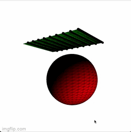
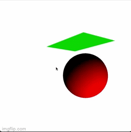
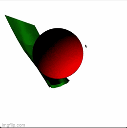
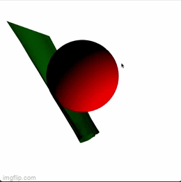
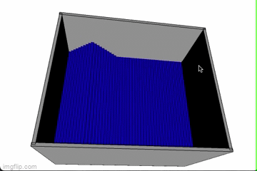

# 5611Project2

### 1 Mutiple Ropes(45 points) and 2 Cloth Simulation(20 points)
Multiple Ropes were implemented with all necessary forces. We can clearly see the length difference as a result of damping forces. In the effort to turn it to a cloth. All adjoint nodes are connected. Nodes on cloth will be affected by the forces exhausted by all surrounding nodes. 

  

### 3 3D Simulation(10 points) and 4 High0quality Rendering(5 points)
We hide all the lines and dots used for cloth simulation before implementing a 3D view of this simulation. We toggle the light and camera to achieve optimal effect. 

  

### 5 Air Darg for Cloth(10 points) and 6 Ripping/Tearing(10 points)
AWind force will be applied at the back of the cloth. Area velocity will increase 10 every time the user presses the “h” key. Wind will force the cloth to interact with the obstacle. If the velocity gets really big, the cloth will break and all forces related to the remaining cloth will be recalcuted. Since the velocity is considerably large, the part of cloth that is being ripped off will disappear(blown outside of this window). 
  
  

### 7 Continuum Fluid Simulation 
Implemented 1D shallow water simulation. Large amounts of water are placed at the high place. Once space is pressed, water are released and we will be able to see the water simulation. 

  

# Difficulties we encoutred. 
One of the hardest difficulties we encountered is how to determine which part of the cloth should be ripped. After discussion, we arrived at three possible methods. One is to check the current wind speed. When the wind speed reaches the curtain threshold, half of the cloth will be ripped off. Second one is to check the velocity of each node. Once it reaches a certain threshold, half of the cloth will be ripped off. The third one, which is the most sophisticated one, is to set a limit on the distance between two adjoint nodes. Once the displacement exceeds that limit, the bond between those two nodes will break. The problem with this is we have to rewrite most of the functions to accommodate this change. We also need to consider the scenarios in which only one of the two strings is attached to the node.
Another issue that arises is how to apply air buoyancy and air resistance on cloth since those two forces also play an important role in cloth simulation. 

# List of tools/Library used
No tools and libraies are used besides what's provided to us. 

Authored by Zirui Chen(chen6713) and Nick Wang(wang9205)

